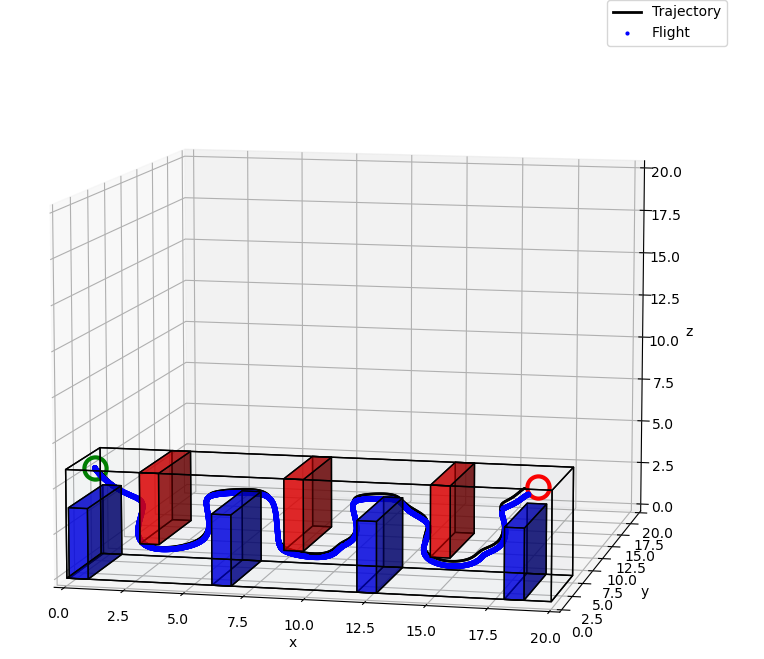
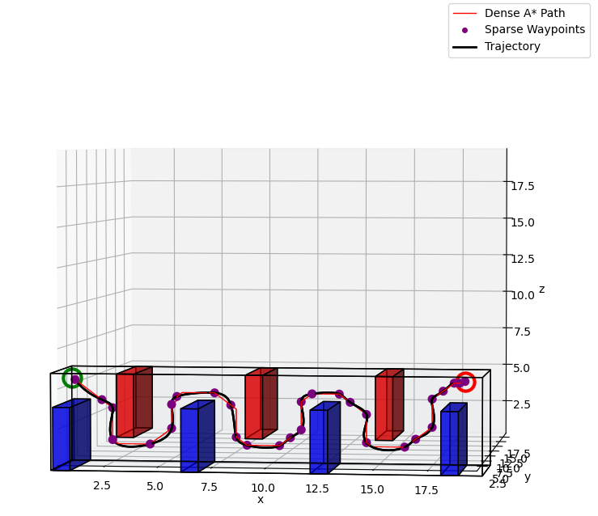

# Quadrotor_planning_and_control

This project was done as the part of the course MEAM620 : Advanced Robotics in UPenn. Thi project involves Control and  dynamics of the quadrotor, planning a path through the obstacles using Djikstra's algorithm and A* algorithm.  
To get the visual inertial odometry, we also fused the IMU measurements and the stereo pair camera images to estimate the pose of the flying robot using Error State Kalman filter (ESKF). Another algorithm to get the VIO is Multistate Constraint Kalman filter (MSCKF) which is implemented [here](https://github.com/rohiitb/msckf_vio_python).
 
The controller was also implemented on a CrazyFlie quadrotor to simulate in the real world.

# Results

Below are some of the maps :

## Map 1 : Maze
<table>
  <tr>
      <td align = "center">  </td>
      <td align = "center">  </td>
      
  </tr>
  <tr>
      <td align = "center"> Maze</td>
      <td align = "center"> Calculated trajectory and path taken </td>
      
  </tr>
    <tr>
      <td align = "center">  </td>
  </tr>
  <tr>
      <td align = "center"> A* path and Waypoints </td>
  </tr>
</table>

## Map 2 : Up-Down

<table>
  <tr>
      <td align = "center">  </td>
      <td align = "center">  </td>
  </tr>
  <tr>
      <td align = "center">Up Down</td>
      <td align = "center"> Calculated trajectory and path taken </td>
      
  </tr>
  <tr>
      <td align = "center">  </td>
  </tr>
  <tr>
      <td align = "center"> A* path and Waypoints </td>
  </tr>
  
</table>

## Map 3 : Window

<table>
  <tr>
      <td align = "center">  </td>
      <td align = "center">  </td>
      <td align = "center">  </td>
  </tr>
  <tr>
      <td align = "center"> Window</td>
      <td align = "center"> Calculated trajectory and path taken </td>
      <td align = "center"> A* path and Waypoints </td>
  </tr>
</table>
